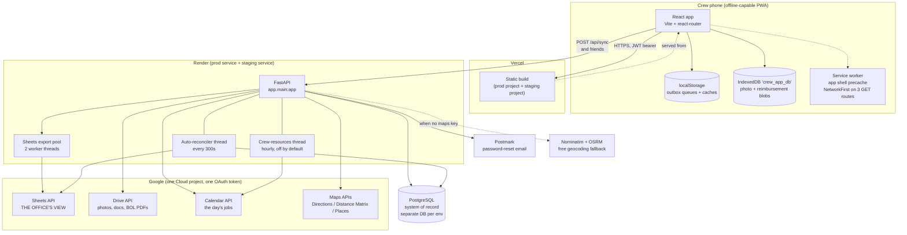

# Architecture

How the pieces fit together, and the handful of behaviors that are not obvious
from reading any single file. If you read one technical doc before touching this
system, read this one.

## The shape of it



## The one-paragraph version

The crew's phone is the interesting part. It is a PWA that assumes it has no
network. Every write lands in a local queue first and renders immediately, then a
drain function POSTs it to the FastAPI backend whenever `navigator.onLine` says
it can. The backend writes to Postgres, which is the system of record, and then
fires the write at Google Sheets on a background thread so the office can see it.
Everything else (Drive, Calendar, Maps, Postmark) hangs off the backend as an
outbound integration that is allowed to fail without taking the request down.

## Two environments, one Google Sheet

There is one production stack and one staging stack: separate Render service,
separate Vercel project, separate Postgres database. Staging has **no real crew
data** and its users are throwaway.

The exception, and the thing that surprises people, is that **both environments
write to the same Google Sheet**. They are kept apart by tab name, not by
spreadsheet. Production writes to `Events`, `Materials`, `JobReports`; staging
writes to `EventsStaging`, `MaterialsStaging`, `JobReportsStaging`. That split is
driven entirely by `SHEETS_*_TAB` environment variables on the Render service.

The failure mode this creates is the one to watch for: **if a `SHEETS_*_TAB`
variable is missing on staging, the code falls back to the production tab name and
test data silently pollutes the office's real sheet.** Every tab variable defaults
to the production name. See [ADR 0003](decisions/0003-staging-prod-sheet-tab-split.md)
and the runbook for the recovery.

Admin → Advanced Settings → System Check → Sheet Syncs flags unset tab variables.
Use it after every deploy that adds one.

## Data flow for a normal job

1. Crew clocks in. An event is created client-side with a `crypto.randomUUID()`
   `event_id`, appended to the log in localStorage, and pushed onto the outbox
   (`crew_event_queue_v1`).
2. If there is signal, the outbox drains immediately to `POST /api/sync`. If not,
   it sits there. The crew keeps working; the UI does not care.
3. The backend upserts the event into Postgres, keyed by `event_id`. Because the
   id came from the client, a retry after a lost response is safe.
4. The backend hands the export to a 2-thread pool, which appends a row to the
   Sheet and records the fact in `sheet_event_exports` so it is never double-written.
5. If the Sheets call fails, the auto-reconciler thread notices within 5 minutes
   that Postgres has an event with no export record, and pushes it. **Sheets export
   is eventually consistent by design.** A row missing from the Sheet for a few
   minutes is normal, not a bug.

`job_uuid` is what ties all of this together. It is derived deterministically on
the client by hashing the job's identity, so a BOL captured offline and a clock-in
captured offline land on the same job even though neither has talked to the server.
This is load-bearing and is described in
[ADR 0005](decisions/0005-client-derived-job-uuid.md).

## The offline layer, in detail

This is the part a naive refactor breaks. There is **no central sync coordinator**
and no Background Sync API. Every feature owns its own queue and its own drain.

**Where things persist:**

- **localStorage** holds the outbox queues (events, materials, BOL, RODS,
  long-distance day, incidents, off-job hours, office hours, estimator items, job
  inventory items) and the read caches and drafts. It is the default.
- **IndexedDB** (`crew_app_db`) holds only the two things too big for
  localStorage: job photo blobs and reimbursement receipt/odometer blobs.

**How a queue drains:** on the `online` event, and in several places also on mount
or `visibilitychange`. Each drain is guarded by a module-level `syncing` flag.
Errors are classified: a 4xx (except 401, 403, 408) is treated as permanent and
the op is dropped; everything else stays queued. 401 and 403 are deliberately
transient so an expired token never destroys a day of queued field work.

**A queue must not depend on its own UI being mounted.** Most drains hang off the
component that owns the feature, which is fine right up until that component stops
rendering. The job-inventory queue drained only from inside `ActualInventory`, so
hiding the Inventory tab on local jobs
([ADR 0015](decisions/0015-inventory-logging-is-paused-on-local-jobs.md)) would have
stranded every item queued offline on a local job: nothing left to mount, nothing left
to drain, and `pruneStale` deleting it 14 days later. It now exposes `drainAll()`, which
`App.tsx` calls on boot and on reconnect regardless of tab or mode. Any queue whose UI
can be feature-flagged off needs the same treatment.

**Why retries are safe:** every payload carries a client-generated UUID, and the
backend upserts on it. This is the single invariant that makes the whole offline
design work, and as of 2026-07-13 every queue honors it (the estimator and
job-inventory item queues were the last two holdouts). Any new offline write must
do the same. See [ADR 0007](decisions/0007-client-uuid-idempotency.md).

**What a new store must do:** use a `crew_` or `mm_` key prefix. `clearCrewState()`
wipes storage by prefix, not from a registry, so a store with any other prefix
will leak one crew member's data to the next person who logs into that phone.

## Auth

A JWT in localStorage (`mm_access_token`), 90-day expiry, no refresh token.

The offline-critical part: the last successful `/api/auth/me` response is cached
(`mm_user_cache_v1`), and on boot the app seeds the user from that cache
synchronously. That is why a crew member at a no-signal jobsite lands in the app
instead of being bounced to the login screen. The background revalidation clears
the user **only** on an explicit 401 or 403 from the server. A network failure
preserves the cached user. Inverting that asymmetry logs the whole crew out the
moment they lose signal.

If `/me` comes back with a different user id than the cached one, all crew state is
wiped before adopting the new identity. That is the shared-phone case: crew member
A logs out, B logs in, and A's queued materials must not sync under B's name.

## Background work on the backend

All of it is in-process threads. No Celery, no cron, no queue service.

- **Sheets export pool**, 2 threads. Every domain write fires its export here and
  returns immediately. The HTTP request never waits on Google.
- **Auto-reconciler**, every 300 seconds. Finds events in Postgres with no export
  record and pushes them, then does the same sweep for signed BOLs
  (`bol_reconcile.py`) - a scheduled BOL export whose pool thread died leaves the
  BOL in Postgres but not the sheet (ADR 0020). Holds a Postgres advisory lock so
  only one worker does it.
- **Sheet backfill** (`sheet_backfill.py`), admin-triggered, not scheduled. The
  reconciler above covers events and BOLs; the other seventeen syncs fire once at
  write time and nothing re-drives them, so an export that died leaves a record in
  Postgres with no sheet row and no trace of which record it was (`sheet_sync_status`
  tracks one state per export *function*). This module diffs the two sides - source
  query per sync vs. the tab's key column read back - and re-drives the real export
  for whatever is missing. Three Sheets reads total for the whole audit, batched, so
  the audit cannot itself trip the quota that caused the gap
  ([ADR 0026](decisions/0026-sheet-writes-retry-quota-and-cache-tab-metadata.md)).
- **Crew-resources loop**, hourly, **off unless `CREW_RESOURCES_ENABLED=true`**.
  Maintains a daily availability summary event on Google Calendar.

## Deployment shape

Render's root directory is `backend`, Vercel's is `frontend`. Migrations do **not**
run at app startup. They run in a separate short-lived process in the start command,
because carrying the Alembic import surface into the web worker was OOM-killing the
512 MB instance. The `--limit-max-requests` and `--limit-concurrency` flags on
uvicorn are there for the same reason. See
[ADR 0002](decisions/0002-render-start-command.md) before touching any of it.

## The Google Apps Script layer (`apps_script/`)

**There is a fourth runtime, and it is easy to miss.** Besides the backend, the
frontend, and the Sheet itself, some behaviour lives in **Google Apps Script bound
to the spreadsheet** (Sheet → Extensions → Apps Script). It is not deployed by CI,
it is not imported by anything, and nothing in a code search will lead you to it.

| File | What it does |
|---|---|
| `nightly_crew_email.gs` | Time-triggered, ~9 PM Mountain. Reads `JobReports` + `Incidents`, emails new crew feedback and new incidents (with Drive photo links) to management. |
| `job_summary_sidebar.gs` / `.html` | The Job Summary sidebar in the Sheet. |
| `reorder_sheets_newest_first.gs` | Sheet housekeeping. |

**The files in this repo are the source of truth, but they are not what runs.**
What runs is whatever is pasted into the Apps Script editor. Editing the file here
changes nothing until somebody pastes it in. Treat a change to `apps_script/` as
undeployed until that happens.

Two consequences worth knowing before you touch the nightly email:

- **State cannot live on the data rows.** The backend exports replace-style: it
  deletes the row for a `job_uuid` / `incident_uuid` and re-appends it on every save.
  Any "already emailed" flag written onto a `JobReports` or `Incidents` row would be
  wiped the next time the crew saved. That is why the script keeps its own
  `FeedbackEmailLog` and `IncidentEmailLog` tabs, keyed by uuid, which the backend
  never touches.
- **It reads the sheet, not the database.** So anything the email needs must actually
  be exported to a tab first. `incidents.photo_urls` is the cautionary tale: it was a
  snapshot written when the incident was filed, and crew attach photos *after* filing,
  so the column was nearly always empty. It is now rebuilt from the `photos` table on
  export, and tagging a photo re-exports its incident.

## The docs mirror

There is one CI workflow, and it has nothing to do with shipping code.
`.github/workflows/sync-docs-to-drive.yml` runs on every push to `staging` and mirrors
this documentation set into a Google Drive folder as native Google Docs, so a successor
can read it from a phone without cloning the repo.

```
push to staging  ->  GitHub Actions  ->  scripts/sync_docs_to_drive.py  ->  Drive folder
                                          (Google OAuth user token,          (Google Docs)
                                           GOOGLE_OAUTH_TOKEN_JSON secret)
```

It is **one way**. The repo is the source of truth, and anything edited in Drive is
overwritten on the next push. Every mirrored Doc carries a banner saying exactly that.
The script never touches the app, its database, or the Sheet. The worst a broken sync
can do is go red in the Actions tab.

Two things about it are counterintuitive and are explained in
[ADR 0012](decisions/0012-docs-mirror-oauth-not-service-account.md): it authenticates
as a **user**, not a service account (service accounts have no Drive storage quota),
and the Drive folder must be **created by the script**, not by hand (the `drive.file`
scope only sees files this OAuth client created).

## Things that will surprise you

- The frontend never talks to Google directly. Even the address typeahead goes
  through a backend proxy, so the Maps key is never shipped to a phone.
- The service worker is `prompt`, not `autoUpdate`, on purpose. A new build waits
  and the crew applies it via a banner. Auto-updating would reload the page in the
  middle of data entry or a sync. See [ADR 0006](decisions/0006-service-worker-prompt.md).
- The backend boots fine with no Google credentials and no Postgres. Every
  integration degrades to a disabled state rather than crashing. That is what makes
  local development possible without secrets.
- `backend/app/routers/dev.py` exists but is deliberately never registered in
  `main.py`.
- `alembic/env.py` must import **every** model module or
  `alembic revision --autogenerate` emits `DROP TABLE` for the ones it cannot see.
  Seven were missing until 2026-07-13. Keep that import list complete when you add a
  model, and read any generated migration before applying it.
